# Using Processing Android to communicate via OSC

The goal is to use OSC communication to send data from an android phone to a Processing sketch.

## Getting started

### Installing Android Mode

In order to create an android application with Processing, you need to download the Android Mode for Processing (in Processing 3.5.4, as it is not yet compatible with the last version of Processing 4.0).

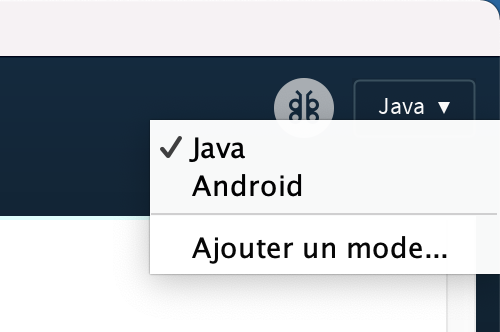

To do so, click on the Java Mode in the top right corner of the Processing window, and select `Add Mode...`.

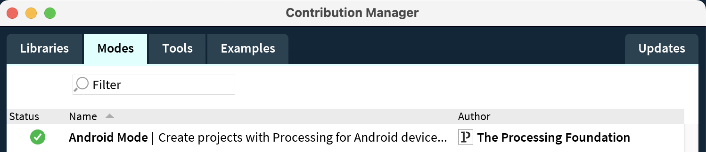

In the Contribution Manager Window, select `Android Mode` and install it.

### Setting up your phone

You need to activate Developer options on your phone by going into the parameters, then the About Phone section, and tap "Build number" 7 times.

Then, connect your phone via USB to your computer. Finally, you can go in Developer options in the parameters and enable USB debugging.

### Back to Processing

On the menu bar, click on Android and make sure `App` is selected, and your phone is selected in the `Devices` tab.

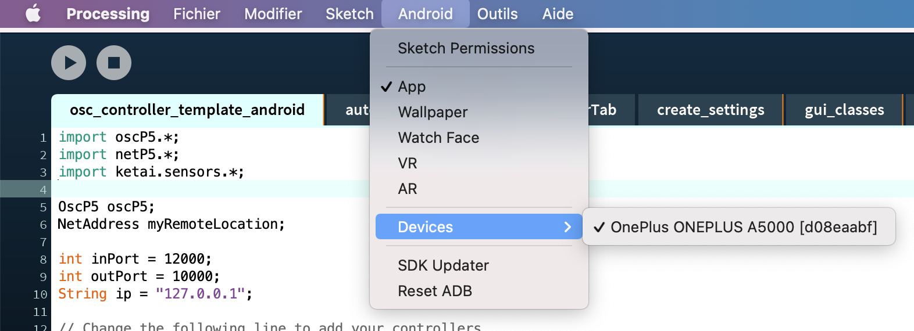

You will also you need to download the **oscP5** library : in the menu bar, click on *Sketch* > *Import Library...* > *Add Library* > Search for oscP5 and click Install.

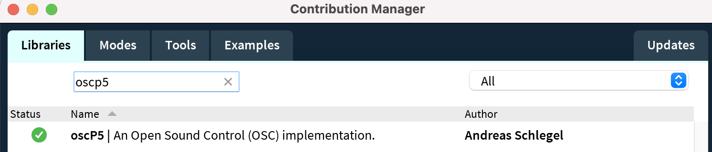

## OSC Controller Template

### Introduction

In the `osc_controller_template_android` folder, you can find the main processing sketch, and several tabs of the sketch.

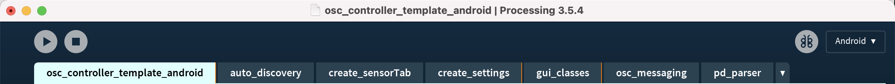

You don't need to change anything in these tabs : 
* `auto_discovery` allows the android app to find the processing receiver on the computer,
* `create_sensorTab` creates the sensor page on the app, 
* `create_settings` creates the settings page on the app, 
* `gui_classes` creates each graphic components, 
* `osc_messaging` sends the osc messages, 
* `pd_parser` scans PureData patches to find and create components.

### Pages

You can modify the code of the main sketch starting with the line 13 : the array `pages` allows you to store the pages that will appear on your android app. 

The `Settings` page will allow you to connect your phone to your computer via OSC and chose the OSC client you will send data to.

The `Sensors` page will allow you to chose which datas from your phone sensors (mic, light, accelerometer and orientation) to send.

The `Test` page is created after the `Test.pd` PureData patch in the data folder : by opening the patch in PureData and changing its components, you change the page in your application.

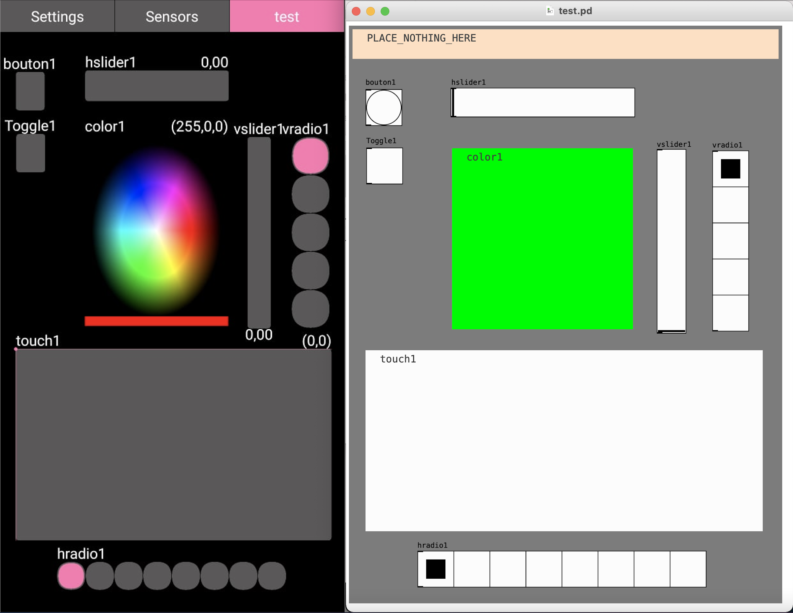
*Comparison of the Test page on the app and on the PureData patch.*

### Getting started with PureData interface

To edit the patch, switch to edit mode with ctrl+E. 

You can add button (as bang), toggle, sliders, radio buttons, touch surface and color selector surface (as canvas), by going to the menu bar > Add.

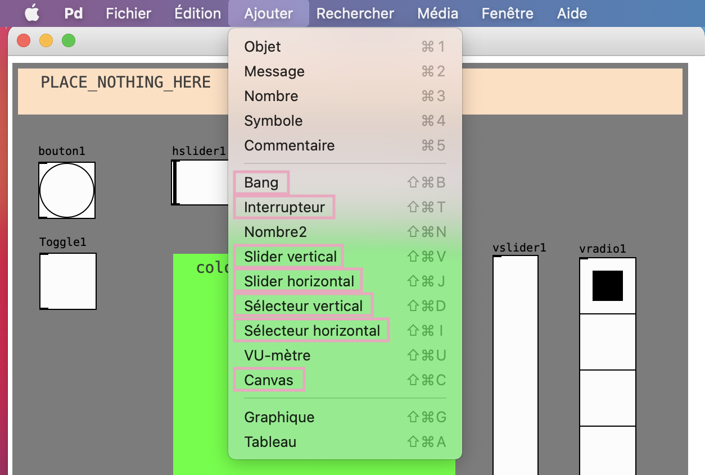

With right-click > Properties, you can change the label and size of the component. 

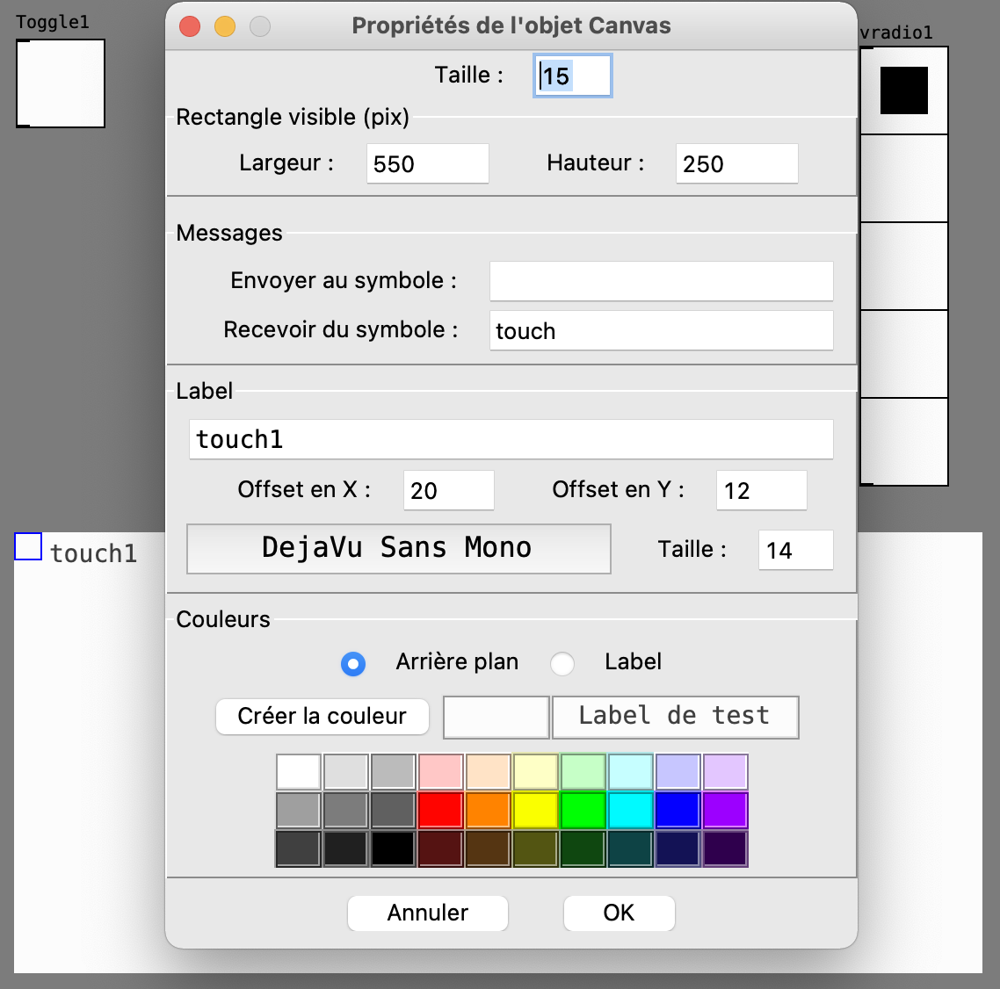

For a **toggle**, you can modify the value if switched on (1 by default).

For a **slider**, you can modify its starting and ending value (0 to 127 by default). 

For a **radio button**, you can modify the amount of boxes.

You can label them as you want, but in order to create a touch surface canvas or a color selector surface, you need to add the mention "touch" or "color" in `Receive symbol`.

### Adding pages

You can therefore create as many pages based on PureData patch, by adding their name to the `pages` array, and adding the patch in the data folder.

In the sketch, the pages are created from the patches by the lines 52 to 55 :

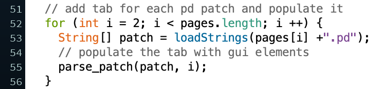

### Removing the Sensors page

If you don't need the Sensors page, you can take it off the `pages` array and change the line 52 from `int i = 2` to `int i = 1`, and comment the function `create_sensorTab();` from line 59.

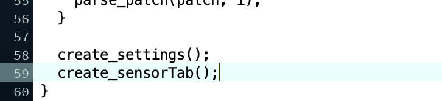

### Customisation 

You can change differents visuals settings in the lines 15 to 22. 

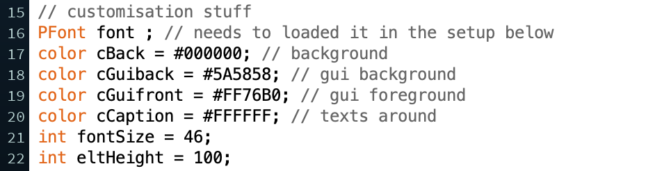

