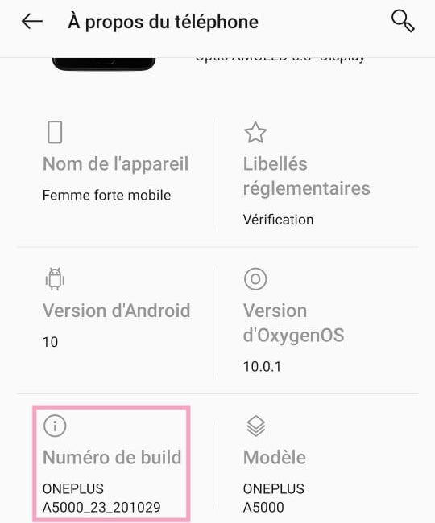

# Using Processing Android to communicate via OSC

The goal is to use OSC communication to send data from an android phone to a Processing sketch.

## Getting started

### Installing Android Mode

In order to create an android application with Processing, you need to download the Android Mode for Processing (in Processing 3.5.4, as it is not yet compatible with the last version of Processing 4.0).

To do so, click on the Java Mode in the top right corner of the Processing window, and select `Add Mode...`.

In the Contribution Manager Window, select `Andrdoid Mode` and install it.

### Setting up your phone

You need to activate Developer options on your phone by going into the parameters, then the About Phone section, and tap "Build number" 7 times.

Then, connect your phone via USB to your computer. Finally, you can go in Developer options in the parameters and enable USB debugging.

### Back to Processing

On the menu bar, click on Android and make sure `App`is selected, and your phone is selected in the `Devices` tab.

You will also you need to download the `oscP5` library : in the menu bar, click on *Sketch* > *Import Library...* > *Add Library* > Search for oscP5 and click Install.

## OSC Controller Template

### Introduction

In the `osc_controller_template_android` folder, you can find the main processing sketch, and several tabs of the sketch.

You don't need to change anything in these tabs : 
* `auto_discovery` allows the android app to find the processing receiver on the computer,
* `create_sensorTab` creates the sensor page on the app, 
* `create_settings` creates the settings page on the app, 
* `gui_classes` creates each graphic components, 
* `osc_messaging` sends the osc messages, 
* `pd_parser` scans PureData patches to find and create components.
